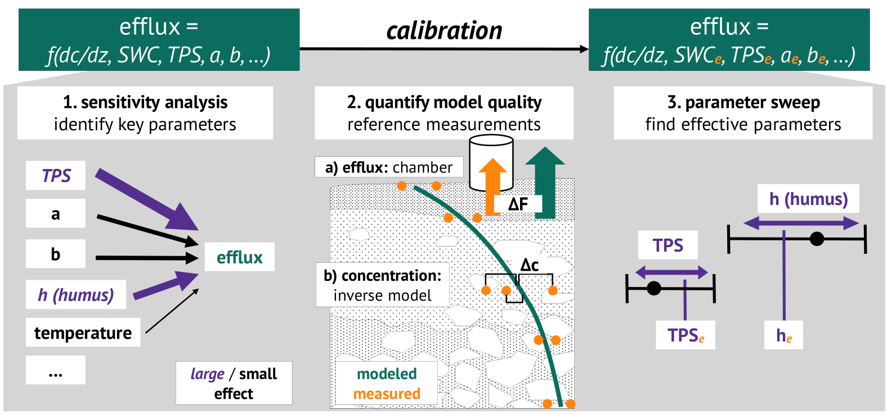

```{r setup, include=FALSE}
knitr::opts_chunk$set(echo = FALSE)
```

## Motivation
Soils can be very heterogeneous on a small spatial scale. For example, porosity can change within the range of tens of centimeters based on the presence or absence of a large stone, earth worm pores or plant roots. This has direct effects on diffusivity and the distribution and transport of soil gases. 

When modelling gas fluxes using the Flux-Gradient-Method (FGM), this heterogeneity often cannot be accounted for due to the need for calculatable, discrete values. Usually, average values for porosity, horizon thicknesses etc. are assumed instead. This can lead to a mismatch between the assumed diffusivity and the actual diffusivity at the site where the concentration gradient is measured.

This is illustrated with a fictitious dataset below, where the soil is less porous at `x = 20` leading to a different distribution of a soil gas (contours in ppm) at that site. Depending on where the concentration profile is measured (e.g. `x = 10, x = 20`), the resulting flux would be higher/lower if average TPS are assumed. 

```{r, echo = FALSE, message=FALSE, warning = FALSE, fig.align='center', fig.width = 12, fig.height = 5}
library(dplyr)
library(ggplot2)

df <- data.frame(upper = c(5,0,-20), 
                 lower = c(0,-20,-100), 
                 TPS = c(0.8,0.6,0.4)) %>%
  mutate(count = upper-lower) %>%
  tidyr::uncount(count,.id = "y") %>%
  mutate(upper = upper - (y - 1)) %>%
  mutate(lower = upper - 1) %>%
  tidyr::uncount(30, .id = "x") %>%
  mutate( TPS = TPS * (abs((20-x))/50 + 1)) %>%
  mutate(TPS = TPS*rnorm(n(),1,sd = 0.03)) %>% 
  arrange(desc(lower)) %>% 
  group_by(x) %>%
  mutate(conc = 400+cumsum((1-TPS)*40))

p1 <- 
df %>%
  ggplot(aes(x = x, y = upper, fill = TPS))+
  geom_tile(aes(x = x, y = (upper-0.5), height = 1))+
  scale_fill_viridis_c()+
  geom_contour(aes(x=x, y = upper-0.5, z = conc),
               col = "white")+
  metR::geom_text_contour(aes(z = conc), col = "white")+
  ylab("soil depth [cm]")+
  xlab("x [cm]")+
  geom_vline(data = data.frame(x = c(10,20)),
             aes(xintercept = x, col = factor(x)))+
  ggtitle("porosity profile")+
  theme_bw()

p2 <- 
  df %>%
  filter(x %in% c(10,20)) %>%
  ggplot(aes(x=conc, y = upper, col = factor(x)))+
  geom_line()+
  ylab("soil depth [cm]")+
  xlab("concentration [ppm]")+
  ggtitle("concentration profile")+
  theme_bw()

ggpubr::ggarrange(plotlist = list(p1,p2), ncol = 2)
```


## Effective Parameters

Instead of using average values, following a one-size-fits-all approach, **effective parameter values** can be found instead that better reflect the actual conditions at the site where the concentration gradient is measured. This is a way of **calibrating** FGM models and accounting for heterogeneity-induced potential biases.

Here, we present a concept for such a calibration that includes three main aspects: (1) *sensitivity analysis*, (2) *model quality quantification* and (3) *parameter sweep*.

```{r, fig.align='center', out.width="70%"}

```

## Sensitivity Analysis

The first step of the calibration is performing a sensitivity analysis. Here, every input parameter of the model is varied within a given range of plausible values (e.g. mean &pm; standard deviation). The effect of each parameter on the model output (i.e. efflux) is measured so that key parameters can be identified that have the highest effect on the model output if changed. This can be achieved by estimating so-called Sobol-indices:

Sobol, I. M. (2001). Global sensitivity indices for nonlinear mathematical models and their Monte Carlo estimates. In Mathematics and Computers in Simulation (Vol. 55, Issues 1–3, pp. 271–280). Elsevier BV. https://doi.org/10.1016/s0378-4754(00)00270-6 

The goal of this step is to identify the key parameters that have the highest effect, so that the calibration efforts can focus on those parameters first. 


## Quantifying Model Quality 
To compare different model parameterisations with each other, the 'quality' of the model needs to be quantified. This can be done by comparing model outputs to reference measurements. This can include a) measurements of efflux performed in parallel with a different method (e.g. the chamber method), or b) an 'intrinsic' property when fitting inverse models against the measured concentration profile. In both cases, the quality can then be assessed by comparing the difference between modeled and measured values in the form of a (Normalized) Root-Mean-Square-Error (NRMSE).

**a) NRMSE to efflux measurements**:
By measuring the efflux in parallel using e.g. the chamber method, it is possible to compare modeled and measured effluxes. This can be used as a model quality parameter:
$$
\small
NRMSE_{flux} = \frac{\sqrt{\frac{1}{n}\sum_{i = 1}^{n}{(F_{model,i}-F_{measured,i})^2}}}{sd(F_{measured})}
$$

**b) NRMSE to concentration measurements**:
Assuming a constant production rate $\small P$ and apparent diffusion coefficient $\small D_s$ and an incoming flux $\small F_{in}$ it is possible to calculate the concentration of a gas within a homogeneous soil layer of height $\small z$ and a concentration $\small c_0$ at the bottom of the layer:

$$
\small
c(z) = - \frac{P}{2 \cdot D_s} \cdot z^2 - \frac{F_{in}}{D_s} \cdot z + c_0
$$

It is then possible to optimize the production rate $\small P$ to fit a measured concentration profile. This is explained in more detail in Jochheim et al. (2022), and the supplementary material therein. This enables the calibration of models by comparing the modeled to the measured concentration profile across multiple measurements and minimizing the respective error:
$$
\small
NRMSE_{concentration} = \frac{\sqrt{\frac{1}{n}\sum_{i = 1}^{n}{(c_{model,i}-c_{measured,i})^2}}}{sd(c_{measured})}
$$
Due to the range of observed values being very different depending on the depth of the observation (e.g. CO~2~ has much higher variability at 1 m depth than at the surface), it can be advantageous to estimate this parameter for each soil depth individually and taking the mean across all soil depths.

## Parameter Sweep
The last step of the calibration is then to perform a parameter sweep or an optimization to find the set of **effective values** of the key parameters identified in the sensitivity analysis that lead to the 'best' model result. The 'best' model result can be the minimization of one, or a multiple of the quality parameters defined on the previous slide. 

Key parameters are varied at random within the expected range of plausible values (e.g. mean &pm; standard deviation) for a set number of runs. For each run, the quality parameter is calculated. The run with the smallest (sum of) the quality parameters is then assumed as the calibrated model and its set of input parameters as the **effective values**.


## R-Package ConFluxPro


<!-- badges: start -->
[](https://lifecycle.r-lib.org/articles/stages.html#experimental)
[](https://CRAN.R-project.org/package=ConFluxPro)
<!-- badges: end -->


<a></a>

In the process of applying this concept, a new R-Package was developed that implements three aspects of FGM-modelling:

1. 'classic' FGM models with linear, linear spline & exponential gradient estimation
1. inverse FGM model with optimization of production rates
1. calibration of models using the concept described here

While it is still experimental and in development, we encourage you to try it out. You can download it for free from github: 
https://github.com/valentingar/ConFluxPro

## Get in touch!
Thank you for visiting this display material! You can contact us using the following addresses:

- Valentin Gartiser valentin.gartiser@student.uni-tuebingen.de
- Martin Maier martin.maier@forst-bwl.de


## Bibliography

Jochheim, H., Wirth, S., Gartiser, V., Paulus, S., Haas, C., Gerke, H. H., & Maier, M. (2022). Dynamics of Soil CO2 Efflux and Vertical CO2 Production in a European Beech and a Scots Pine Forest. In Frontiers in Forests and Global Change (Vol. 5). Frontiers Media SA. https://doi.org/10.3389/ffgc.2022.826298 

Sobol, I. M. (2001). Global sensitivity indices for nonlinear mathematical models and their Monte Carlo estimates. In Mathematics and Computers in Simulation (Vol. 55, Issues 1–3, pp. 271–280). Elsevier BV. https://doi.org/10.1016/s0378-4754(00)00270-6 

